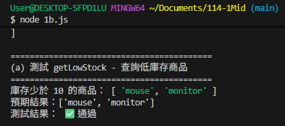
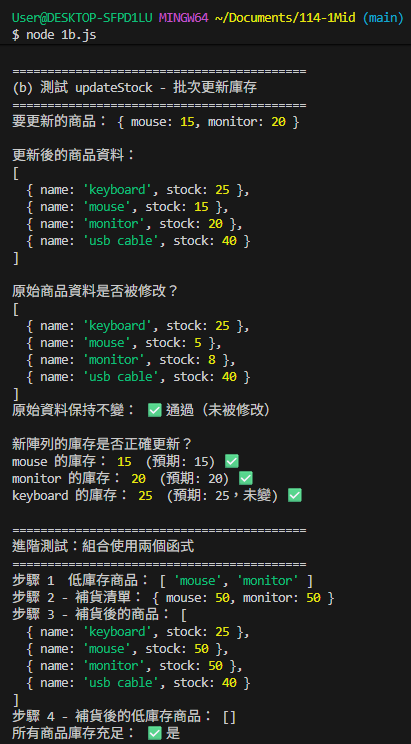
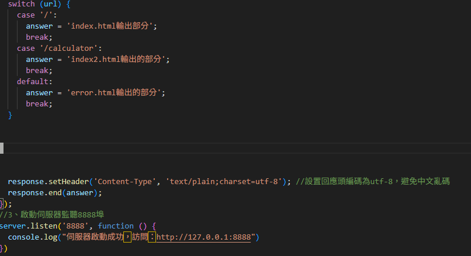
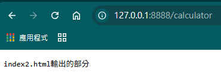
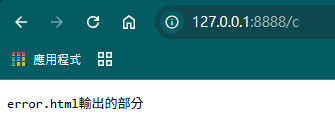
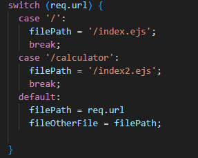
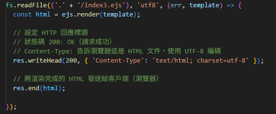

# 第2次隨堂題目-隨堂-QZ2
>
>學號：112111133   (學號和姓名都要寫)
> 
>姓名：林凱翎
>

請在撰寫"說明程式與內容"該塊內容，請把原該塊內上述敘述刪除，該塊上述內容只是用來指引該怎麼撰寫內容。

1. a.

Ans:
宣告一個陣列，裡面每個元素都是物件

1. b.

Ans:
程式碼:

執行結果:

1. c.

Ans:
程式碼:

執行結果:

2. a.

Ans:
程式碼:

執行結果:

2. b.

Ans:
程式碼:

執行結果:

2. c.

Ans:
程式碼:

執行結果:

2. d.

Ans:
執行兩次 or 三次

